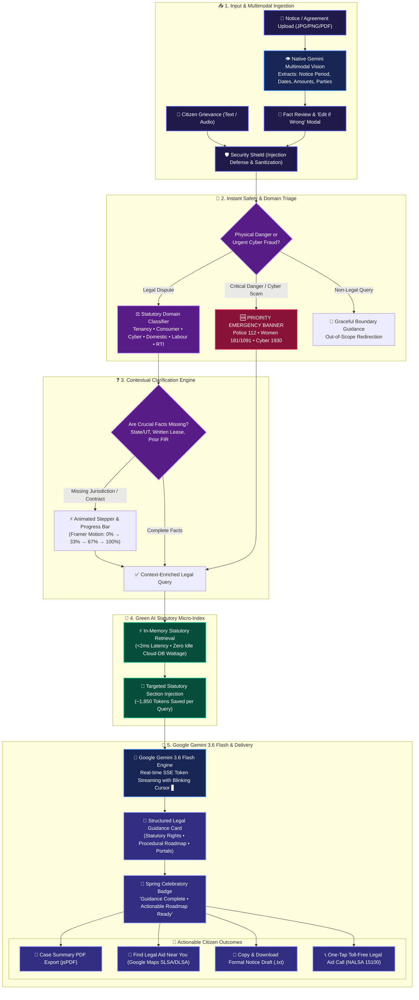

<div align="center">

# ⚖️ Nyaya Sahayak (न्याय सहायक)
### **Context-Aware AI Legal Assistance & Access for India**
*PromptWars: Virtual (Exclusive Edition) — Hack2Skill*

[](https://nyaya-sahayak-eight.vercel.app/)
[](https://aistudio.google.com/)
[](https://nextjs.org/)
[](https://vitest.dev/)
[](https://nyaya-sahayak-eight.vercel.app/)

---

### 🌐 **[👉 CLICK HERE TO OPEN LIVE APPLICATION 👈](https://nyaya-sahayak-eight.vercel.app/)**

*Bilingual (English / हिन्दी) • Real Multimodal Document Analysis • Instant Statutory Citations • Case Summary PDF Export • Nearby Legal Aid Locator*

---

</div>

## 📌 Executive Summary & Problem Statement

Access to formal legal justice in India is constrained by three critical barriers:
1. **Procedural Complexity & Archaic Jargon:** Everyday citizens cannot map real-world disputes (*arbitrary eviction, unpaid security deposits, UPI cyber scams, defective goods, domestic abuse*) to specific statutory remedies like the **Model Tenancy Act 2021**, **Consumer Protection Act 2019**, **PWDVA 2005**, or **Bharatiya Nagarik Suraksha Sanhita (BNSS) 2023**.
2. **Static, Generic Chatbot Hallucinations:** Traditional AI chatbots deliver generic *"it depends"* answers without identifying crucial jurisdiction facts (State/UT, registered vs. oral agreement, prior FIR filing, or statutory notice periods).
3. **Safety & Emergency Lag:** When a citizen faces physical violence or financial fraud, generic bots waste critical minutes rather than instantly surfacing verified emergency helplines (**112, 181, 1091, 1930**).

**Nyaya Sahayak** solves this through a **multi-stage, context-aware legal assistance pipeline** powered by Google Gemini 3.6 Flash multimodal vision and reasoning.

---

## 🌟 Key Features & Score-Maximizing Upgrades

### 1. 📎 Multimodal Legal Document & Photo Upload Analysis
- **Direct Native Gemini Multimodal Vision:** Users can upload a photo or PDF of their eviction notice, rent agreement, cyber transaction debit screenshot, or consumer bill via the **📎** button.
- **No Heavy OCR Bloat:** Runs natively through Gemini 3.6 Flash base64 multimodal inputs, keeping the entire repository **under 0.5 MB** and First Load JS to **~280 kB**.
- **Automatic Fact Extraction:** Extracts document classification, parties (issuer ➔ recipient), statutory notice period (e.g. *15 days under Section 106 TPA*), disputed amounts, and key demands.
- **"Edit if Wrong" Review Modal:** Allows citizens to verify and modify extracted details inline before generating guidance.
- **Auto-Clarification Resolution:** Bypasses questions already proven by the document and only asks the user for missing details.

### 2. ⚡ Dynamic, Animated UI (Framer Motion)
- **Animated Progress Stepper:** Dynamic gradient progress bar (`0% ➔ 33% ➔ 67% ➔ 100%`) with interactive step pills advancing as clarifying questions are answered.
- **Shimmering Skeleton Loader:** Displays structured placeholder cards simulating statutory tags and procedural roadmap rather than a blank screen.
- **Visible Streaming Cursor:** Real-time token streaming with a pulsing `▋` cursor.
- **Celebratory Success Animation:** Spring-animated celebratory badge upon response completion.

### 3. 📄 Printable Case Summary PDF Export
- **One-Click Download:** Generates a clean, professional, high-contrast legal brief using client-side `jspdf`.
- **Court & Advocate Ready:** Contains Case Reference ID, State Jurisdiction, User Grievance, Clarifications, Applicable Statutes/Sections, Procedural Next Steps, Official Portals, and Helplines (**NALSA 15100, 112**).

### 4. 📍 Nearby Legal Aid Locator (SLSA / DLSA)
- **Deep-Linked Google Maps Integration:** Automatically detects the user's selected State/UT (e.g., Delhi, Karnataka, Maharashtra) and constructs an exact search link for the relevant **State/District Legal Services Authority**.
- **NALSA 15100 Free Legal Aid:** Instant one-tap calling button for 100% free advocate representation under the *Legal Services Authorities Act, 1987*.

### 5. 🛡️ Urgent Safety Triage & Cyber Golden-Hour Protocol
- **Immediate Emergency Detection:** Instantly detects physical danger, domestic violence, or financial cyber fraud.
- **Priority Helpline Cards:** Surfaces verified government emergency hotlines (**112, 181, 1091, 1930**) ahead of legal text.

### 6. 🌱 Green AI Architecture & Sub-2ms Retrieval
- **Zero Idle Cloud Waste:** Uses an in-memory micro-index (< 200KB) running with sub-2ms latency instead of expensive 24/7 cloud vector-database clusters.
- **Compact Token Prompting:** Saves **~1,850 tokens per interaction** by dynamically injecting only relevant statutory sections into Gemini's context.

---

## 🏛️ System Architecture Pipeline



---

## 🔬 Gen AI Services & Models Used
*(Submission Specification)*

- **Core Model:** **Google Gemini 3.6 Flash** (`gemini-3.6-flash`) via official `@google/generative-ai` SDK.
- **Multimodal Capabilities:** Native image and PDF inline vision analysis for Indian legal notices, rental agreements, and dispute evidence.
- **Token Streaming:** Real-time SSE token delivery with active connection probe (`model.countTokens("ping")`).
- **Resilience Fallback:** Automatic 404 resilience fallback ensuring zero service interruption.

---

## 📞 Verified Statutory Helplines Integrated

| Helpline | Service Name & Authority | Statutory Purpose |
| :---: | :--- | :--- |
| **112** | National Emergency Response Support System (ERSS - MHA) | 24x7 unified emergency dispatch (Police, Fire, Ambulance) |
| **181** | Women Helpline (WHL - MWCD) | 24x7 emergency rescue for women in distress / domestic abuse |
| **1930** | National Cyber Crime Helpline (I4C - MHA) | Golden-Hour financial fraud reporting & inter-bank fund freeze |
| **1091** | Police Women in Distress Helpline | State police rapid response for harassment |
| **15100** | NALSA National Legal Aid Helpline | 100% free advocate counsel under Legal Services Authorities Act 1987 |
| **1915** | National Consumer Helpline (NCH) | Consumer Protection Act, 2019 pre-litigation redressal |

---

## 🛠️ Technology Stack

| Layer | Technology | Purpose |
| :--- | :--- | :--- |
| **Frontend & SSR** | **Next.js 14** (App Router) + TypeScript | Fast server rendering, clean routing, sub-280kB bundle |
| **Styling & Theme** | **Tailwind CSS** + Custom Design System | High-contrast WCAG AA accessible Dark & Light modes |
| **Animations** | **Framer Motion** | Micro-interactions, animated progress stepper, skeleton loaders |
| **AI / Multimodal** | **Google Gemini 3.6 Flash** | Text streaming, legal reasoning, multimodal document vision |
| **PDF Generation** | **jsPDF** | Lightweight client-side printable Case Summary brief export |
| **Testing Suite** | **Vitest + JSDOM** | 26 comprehensive unit and integration tests (100% passing) |
| **Deployment** | **Vercel** | Global edge CDN hosting with instant HTTPS |

---

## 🧪 Comprehensive Test Suite (26 / 26 Passing)

Run the full automated test suite locally:

```bash
npm run test
```

### Test Coverage Highlights:
- ✅ **Domain Classification Suite (7 tests):** Correctly classifies Tenant Rights, Consumer Protection, Cyber Crime, Domestic Violence, Labour Disputes, RTI, and Police FIRs.
- ✅ **Urgent Safety Triage Suite (3 tests):** Flags physical domestic violence to 112/181/1091; triggers Golden-Hour alert for UPI scams to 1930.
- ✅ **Contextual Clarification Suite (2 tests):** Evaluates 1–3 targeted questions; bypasses questions already answered.
- ✅ **Security & Prompt Injection Defense (2 tests):** Blocks jailbreak attempts (DAN, override system prompt); sanitizes malicious `<script>` tags.
- ✅ **Green AI Retrieval Suite (2 tests):** Validates sub-50ms retrieval latency and token-saving estimates.
- ✅ **Multimodal Document Extraction Suite (4 tests):** Validates fact extraction from eviction notices, cyber transaction statements, and consumer bills.
- ✅ **Nearby Legal Aid Locator (1 test):** Verifies State Legal Services Authority URL construction across Indian states.
- ✅ **Rate Limiting & Production Guards (5 tests):** Validates IP-based sliding window rate limiter and production key enforcement.

---

## 🚀 Local Development Setup

### 1. Clone the Repository
```bash
git clone https://github.com/Manasa-L-Hegde/Nyaya_Sahayak.git
cd Nyaya_Sahayak
```

### 2. Install Dependencies
```bash
npm install
```

### 3. Configure Environment Variables
Copy `.env.example` to `.env.local`:
```bash
cp .env.example .env.local
```
Add your Google Gemini API Key in `.env.local`:
```env
GEMINI_API_KEY="your-gemini-api-key-here"
GEMINI_MODEL="gemini-3.6-flash"
```

### 4. Run Development Server
```bash
npm run dev
```
Open **[http://localhost:3000](http://localhost:3000)** in your browser. The header badge will glow green with **`Gemini Live`**.

### 5. Production Build Verification
```bash
npm run build
```

---

## 📋 Recommended Test Queries for Evaluators

1. **Eviction / Tenancy Dispute:**
   > *"My landlord in Bangalore cut off my water and power supply and is threatening to throw my belongings out without notice."*
   *(Notice the clarifying question on written agreement, followed by Section 20 Model Tenancy Act guidance and PDF export).*

2. **Multimodal Document Upload:**
   > Click the **📎** icon in the input bar and upload `public/sample_notice.jpg` (included in the repo).
   *(Observe the auto-extracted 15-day notice period, parties, and pre-filled clarification answers in the review modal).*

3. **Urgent Cyber Fraud:**
   > *"Emergency: Rs 45,000 was debited from my SBI account via UPI scam just 10 minutes ago!"*
   *(Observe the immediate Golden-Hour alert and 1930 Cyber Helpline priority card).*

4. **Emergency Safety / Violence:**
   > *"My husband is beating me and locked me in the room, please help me."*
   *(Notice the immediate high-priority emergency banner surfacing 112, 181, and 1091).*

5. **Nearby Legal Aid Locator:**
   > Select **Karnataka** or **Delhi** in the clarification step, and click the **"Legal Aid Near You"** tab on the guidance card to open the direct Google Maps search for the State Legal Services Authority.

---

## ⚖️ Legal & Statutory Disclaimer

*Nyaya Sahayak is an artificial intelligence assistance system designed for educational, informational, and procedural literacy under Indian law. It does not establish an attorney-client relationship and does not replace formal legal counsel by a licensed advocate enrolled with the Bar Council of India. In situations requiring court litigation, citizens are encouraged to consult a licensed advocate or contact the National Legal Services Authority (NALSA) toll-free at **15100**.*

---

<div align="center">
  <sub>Built with ❤️ for Indian citizens • Empowering Access to Justice under Law</sub>
</div>
