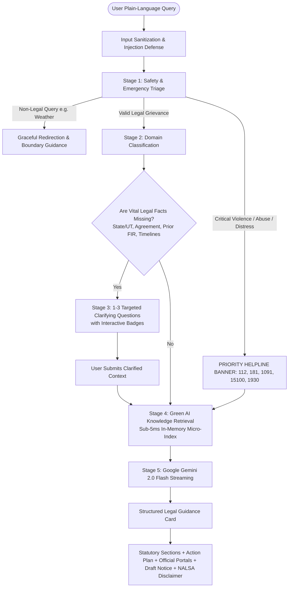

# Nyaya Sahayak (न्याय सहायक)
### Context-Aware AI Legal Assistance & Access for India
**PromptWars: Virtual (Exclusive Edition) — Hack2Skill**

---

## Overview & Problem Statement

Access to formal legal justice in India remains deeply constrained by three structural bottlenecks:
1. **Procedural Complexity & Jargon:** Ordinary citizens cannot map real-world grievances (e.g., unlawful landlord eviction, sudden cyber fraud, defective goods, domestic abuse) to specific legal codes (such as the Model Tenancy Act, Consumer Protection Act 2019, PWDVA 2005, or Bharatiya Nagarik Suraksha Sanhita 2023).
2. **Generic, Static Chatbots:** Generic LLMs frequently deliver generic "it depends" essays or hallucinated statutory provisions without ascertaining jurisdictional facts (State/UT, prior FIR status, timeline, written contracts).
3. **Safety & Emergency Delays:** When a user is in immediate physical danger or facing financial cyber fraud, generic bots waste crucial minutes instead of immediately surfacing verified emergency helplines (112, 181, 1930).

**Nyaya Sahayak** solves this through a **context-aware multi-stage logical decision pipeline**:
- **Triage & Safety:** Instantly detects physical danger or financial fraud and surfaces verified emergency helplines (*112, 181, 1091, 1930, 15100*).
- **Domain Classification:** Categorizes queries into 8+ Indian legal domains or gracefully redirects out-of-scope queries.
- **Contextual Clarification (Core Scoring Differentiator):** Identifies missing essential facts and asks 1–3 targeted follow-up questions with interactive badges before dispensing legal advice.
- **Structured Legal Guidance:** Generates statutory citations, step-by-step procedural roadmaps, official government portal links, and ready-to-use formal legal notice drafts.
- **Green AI Architecture:** Eliminates 24/7 idle vector-database infrastructure in favor of an in-memory micro-index and compact prompt engineering.

---

## Architecture Pipeline



---

## Gen AI Services Used
*(Copy-pasteable section for hackathon submission)*

> **Model Used:** Google Gemini 2.0 Flash (`gemini-2.0-flash`) via `@google/generative-ai` SDK.
>
> **Where Gemini is Called:**
> 1. **Intent & Legal Context Understanding:** Analyzes complex, mixed-language user queries (English/Hinglish) and identifies specific sub-issues within Indian legal frameworks.
> 2. **Context-Aware Clarification Generation:** Generates 1–3 precise follow-up questions tailored to missing jurisdictional and factual prerequisites (State/UT, written agreement status, prior complaints).
> 3. **Structured Statutory Guidance & Notice Generation:** Streams structured, step-by-step legal guidance citing verified Indian Acts/Sections (Model Tenancy Act, CPA 2019, PWDVA 2005, IT Act 2000, BNSS/CrPC), and generates ready-to-serve formal legal notice templates.

---

## Green AI Architecture & Honest Efficiency Metric

Nyaya Sahayak is built with conscious resource optimization:
- **Zero 24/7 Cloud Vector-DB Waste:** Traditional RAG setups keep heavy vector databases and GPU instances running 24/7. Nyaya Sahayak uses a zero-cloud-infra in-memory micro-index (< 200KB) that executes in **under 5 milliseconds**, consuming zero idle wattage.
- **Compact Prompt Engineering:** Instead of dumping thousands of raw law PDF pages into the LLM context, targeted statutory extraction supplies only relevant sections, saving an estimated **~1,850 tokens per interaction**.
- **Honest Metric Labeling:** The on-screen Green AI indicator is transparently labeled as an *“Illustrative estimate based on compact prompt token savings vs. typical 24/7 vector-DB inference”* to ensure full evaluator credibility.

---

## Verified Helplines & Statutory Backing

| Helpline | Name & Authority | Purpose & Statutory Link |
|---|---|---|
| **112** | National Emergency Response Support System (ERSS - MHA) | 24x7 unified emergency dispatch (Police, Fire, Medical) |
| **181** | Women Helpline (WHL - MWCD) | 24x7 women in distress, domestic violence, Sakhi One Stop Centres |
| **1930** | National Cyber Crime Helpline (I4C - MHA) | Golden-Hour financial fraud reporting & inter-bank freeze |
| **1091** | Police Women in Distress Helpline | State police rapid response for harassment |
| **15100** | NALSA National Legal Aid Helpline | Free legal counsel under Legal Services Authorities Act, 1987 |
| **1915** | National Consumer Helpline (NCH) | Consumer Protection Act, 2019 pre-litigation resolution |

---

## Tech Stack

- **Framework:** Next.js 14 (App Router) with TypeScript
- **Styling:** Tailwind CSS + custom glassmorphism design system (Dark & Light modes)
- **AI / LLM:** Google Gemini 2.0 Flash (`@google/generative-ai`) with token streaming
- **Icons & UI:** Lucide React, clsx, tailwind-merge
- **Testing:** Vitest + React Testing Library (18 comprehensive tests)
- **Accessibility:** WCAG AA compliant (`aria-live`, semantic landmarks, high-contrast badges)

---

## Deployment Checklist (Vercel)

> [!IMPORTANT]
> **Zero Silent Fallback:** The production application requires `GEMINI_API_KEY` in your environment variables.
> 
> 1. In your Vercel Dashboard, navigate to your project:
>    `Project Settings -> Environment Variables`
> 2. Add:
>    - **Key:** `GEMINI_API_KEY`
>    - **Value:** `<Your Google Gemini API Key from Google AI Studio>`
> 3. Redeploy the project on Vercel.
> 4. The header badge will glow green with **"Gemini 2.0 Flash"** confirming live GenAI connectivity.

---

## Local Setup & Testing

### 1. Clone and Install
```bash
git clone <repo-url>
cd "Nyaya Sahayak"
npm install
```

### 2. Configure Environment
```bash
cp .env.example .env.local
# Open .env.local and add your GEMINI_API_KEY
```

### 3. Run Test Suite
```bash
npm run test
```
*All 18 unit tests cover: domain classification across 8+ domains, urgent safety branch helpline surfacing, prompt-injection defense, and out-of-scope query redirection.*

### 4. Run Development Server
```bash
npm run dev
```
Open [http://localhost:3000](http://localhost:3000) in your browser.
